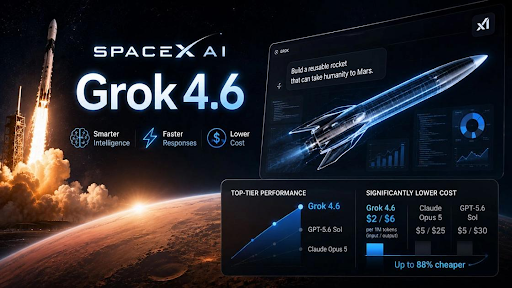
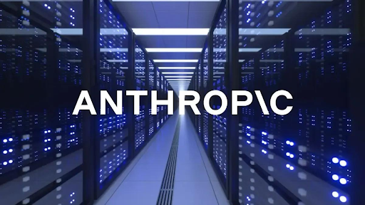
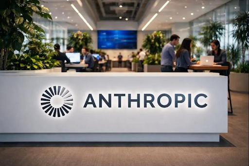
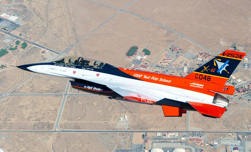
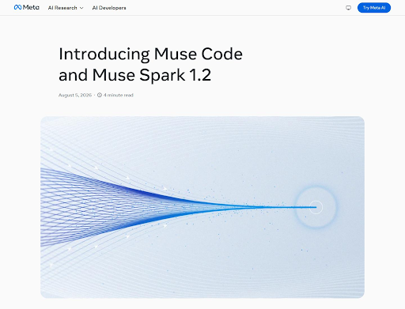

August 2026 marked a significant period of transformation in the artificial intelligence landscape, characterized by rapid advances in model capabilities, large-scale computing investments, open-weight AI development, regulatory preparation, and autonomous systems. This blog examines five major developments from the month, including Google DeepMind's leadership restructuring, xAI's Grok 4.6 launch, Anthropic's major compute commitments and growing focus on AI governance, DARPA's autonomous F-16 flight demonstration, and Meta's expansion of open-weight AI models. Together, these developments demonstrate how competition in AI is increasingly shaped not only by model performance, but also by computing infrastructure, execution speed, open ecosystems, regulatory readiness, and responsible deployment.

# August 2026: AI News Highlights

## 1. Google DeepMind Restructures Leadership; Demis Hassabis Becomes Chairman [^1]

Google announced a major leadership restructuring on August 8, 2026, with Demis Hassabis stepping away from daily operations to become Chairman of Google DeepMind and Alphabet's Chief Scientist. The company's CTO, Koray Kavukcuoglu, now leads operational execution, including Gemini model development and product delivery. The move is aimed at speeding up AI releases while allowing Hassabis to focus on long-term AGI research. By bringing more decision-making closer to its California operations, Google hopes to respond faster to growing competition from OpenAI, Anthropic, and xAI.

## 2. xAI Launches Grok 4.6; Matches OpenAI GPT-5.6 Sol on Performance Benchmarks [^2]

On August 12, 2026, Elon Musk's xAI introduced Grok 4.6, bringing the model's performance close to OpenAI's GPT-5.6 Sol Max on independent intelligence benchmarks. The release includes a 500,000-token context window, stronger reasoning capabilities, and improved coding and mathematical performance. Competitive API pricing makes it an attractive option for developers building AI-powered products. The launch represents a significant milestone for xAI, showing that the frontier AI market is becoming increasingly competitive rather than being dominated by just a few companies. 

## 3. Anthropic Commits $71 Billion in Compute; Sets Massive Infrastructure Wager [^3]

Anthropic announced approximately $71 billion in long-term compute commitments during August 2026, securing access to massive computing infrastructure for future AI model training. Instead of representing immediate spending, these agreements guarantee the company access to advanced GPUs and data center resources needed for increasingly powerful foundation models. The announcement reflects how computing infrastructure has become one of the biggest competitive advantages in AI, alongside model quality and research talent.

## 4. Anthropic Names Tino Cuéllar Chief Global Affairs Officer; Signals Regulatory Pivot [^4]

On August 15, 2026, Anthropic appointed Tino Cuéllar as its first Chief Global Affairs Officer, strengthening the company's focus on AI governance and regulation. Cuéllar previously served as a California Supreme Court Justice and led the Carnegie Endowment for International Peace. His appointment came during growing discussions between major AI companies and U.S. policymakers over future regulations for advanced AI systems. The move signals that AI companies are preparing for a future where policy and compliance will become as important as technological innovation.

## 5. DARPA Completes First Autonomous F-16 Flight; AI Pilots Combat Aircraft [^5]

The U.S. Defense Advanced Research Projects Agency announced the successful completion of the first real-world flight of an F-16 fighter jet fully controlled by artificial intelligence, with no pilot in the loop. The autonomous aircraft executed complex maneuvers, maintained flight stability, and responded to simulated threats during the August 2026 trial. While AI systems have outperformed humans in simulated dogfights for years, autonomous real-world operation of military hardware represents a qualitative leap. The demonstration accelerates international conversations around autonomous weapons proliferation and prompted renewed calls for binding international agreements on AI in military systems.

## 6. Meta Releases Muse Spark 1.2 and Muse Glimmer Open Weights; Doubles Down on Open AI [^6]

Meta released Muse Spark 1.2 and Muse Glimmer 30B under Apache 2.0 license on August 6, 2026, reinforcing its commitment to open-weight model development. The releases included Muse Code, a beta terminal agent capable of planning and validating code changes across large repositories. Mark Zuckerberg posted directly to X that open weights were essential to innovation and that US restrictions on model access only benefited foreign competitors. Meta's strategy contrasts sharply with proprietary competitors: by releasing capable weights openly, the company trades short-term API revenue for long-term ecosystem dominance. The move reflects confidence that whoever owns the best-tuned weights and fine-tuning infrastructure wins long-term.

## Core Considerations for AI's Practical Integration

As AI transitions from breakthrough announcements to widespread deployment, several critical themes emerge. The future of AI will not depend solely on building more powerful models, but on how effectively organizations integrate these systems into real-world applications.

- **Model Capability and Performance**: The AI landscape is becoming increasingly competitive, with frontier models continuously improving their reasoning, coding, mathematical, and contextual capabilities. Recent developments such as xAI's Grok 4.6 demonstrate how quickly AI models are approaching and competing with leading systems in performance benchmarks.
- **Computing Infrastructure**: Access to large-scale computing infrastructure has become a major competitive advantage in AI. Training and deploying increasingly capable foundation models requires significant GPU capacity and data-center resources. Organizations must therefore consider infrastructure availability, scalability, and cost when planning AI deployments.
- **Open vs. Proprietary AI**: The growing availability of open-weight models is creating new opportunities for developers and organizations to experiment, customize, and deploy AI systems. At the same time, proprietary models continue to provide powerful capabilities through managed APIs. Choosing between open and proprietary approaches depends on factors such as flexibility, cost, control, and deployment requirements.
- **AI Governance and Regulation**: As AI becomes more powerful and widely deployed, governance and regulatory compliance are becoming increasingly important. AI organizations are preparing for greater involvement from governments and policymakers. Businesses integrating AI must therefore consider transparency, accountability, compliance, and responsible AI practices alongside technological innovation.
- **Responsible Autonomous AI**: The development of increasingly autonomous AI systems highlights the importance of safety and accountability. As AI moves beyond controlled simulations into real-world environments, organizations need appropriate safeguards, human oversight, and clear responsibility for AI-driven decisions.
- **Execution Speed and Time-to-Market**: Success in the evolving AI ecosystem depends on more than model performance. Organizations must also be able to develop and deploy AI solutions efficiently while adapting to changing technology and regulations. The ability to balance capability, execution speed, and regulatory readiness will become increasingly important.

## Conclusion

August 2026 marked an inflection point where technological ambition collided with regulatory reality and geopolitical pressure. The month saw frontier labs accelerate capability (xAI's Grok 4.6 matching OpenAI's performance, Meta's open-weight commitments, Anthropic's massive compute wager) while simultaneously preparing for government scrutiny. Google's internal restructuring exposed execution gaps that allowed smaller competitors to seize momentum. Meanwhile, DARPA's autonomous F-16 flight and Anthropic's regulatory hire signaled that the era of self-governance in AI was ending—Washington and world capitals are now active participants in shaping the industry's trajectory. For entrepreneurs, researchers, and enterprises, August's developments suggest that September and beyond will bring three parallel competitions: raw capability (model performance), execution speed (time-to-market), and regulatory positioning (navigating increasingly complex compliance landscapes). Winners will excel at all three.

## References

[^1]: [Read More About Google DeepMind](https://www.reuters.com/business/google-shakes-up-ai-leadership-deepmind-chief-shifts-role-2026-08-05/)

[^2]: [Explore Grok 4.6](https://finance.yahoo.com/technology/ai/articles/google-shifts-ai-power-california-000039098.html?guccounter=1)

[^3]: [Read About Anthropic's Compute Strategy](https://www.reuters.com/technology/anthropic-pay-nscale-45-billion-rent-ai-computing-power-bloomberg-news-reports-2026-08-26/)

[^4]: [Learn About AI Governance](https://www.reuters.com/technology/meta-launches-new-ai-coding-tool-powered-by-muse-spark-12-2026-08-05/)

[^5]: [Explore DARPA's AI Flight Test](https://www.darpa.mil/news/2026/darpa-us-air-force-fly-ai-controlled-f-16)

[^6]: [Explore Meta's Open AI Strategy](https://www.reuters.com/technology/meta-launches-new-ai-coding-tool-powered-by-muse-spark-12-2026-08-05/)
